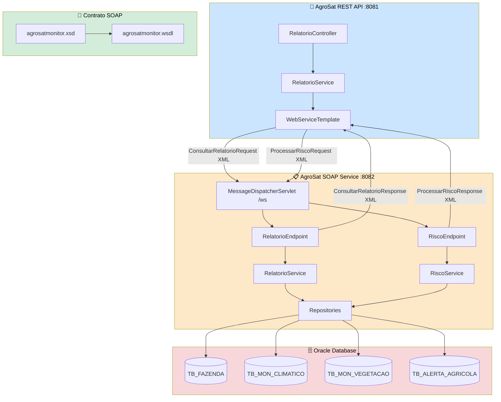
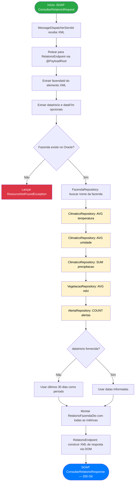
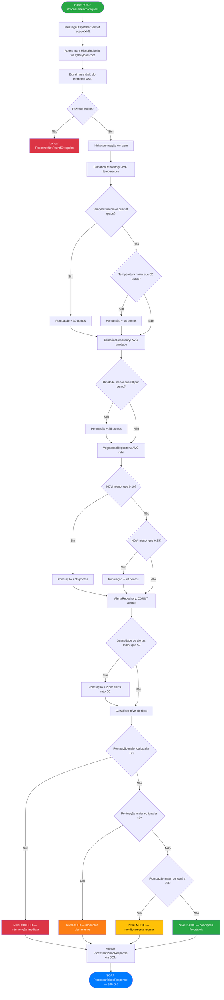
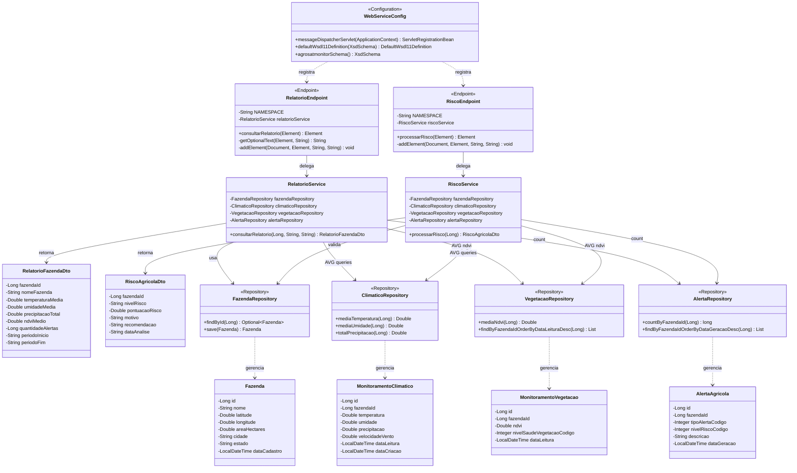
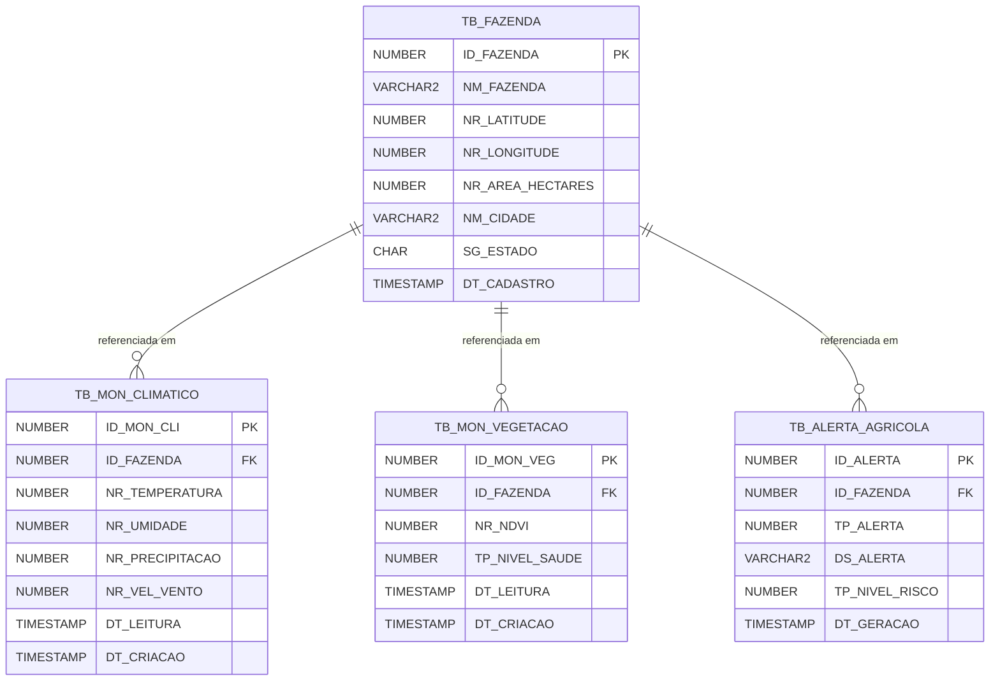

# 📋 AgroSat SOAP Service

> **Space Connect – Tecnologia Espacial Aplicada a Desafios Reais**  
> Web Service SOAP de Relatórios e Análise de Risco Agrícola

---

## 👥 Integrantes

| RM | Nome |
|---|---|
| 557538 | David Cordeiro |
| 555619 | Tiago Morais |
| 557065 | Vinicius Augusto |
| 556892 | Guilherme Lunghini |
| 99856 | Marchel Augusto |

---

## 📋 Sobre o Projeto

O **AgroSat SOAP Service** é o serviço de relatórios da arquitetura SOA do Space Connect. Implementado com **Spring Web Services**, expõe operações SOAP para consolidação de dados históricos de monitoramento agrícola e análise automatizada de risco por fazenda.

Este serviço acessa **diretamente o mesmo banco Oracle** utilizado pela REST API — sem replicação de dados — e expõe seu contrato via **WSDL gerado automaticamente** a partir de um schema XSD. Ele é consumido exclusivamente pela AgroSat REST API, demonstrando o princípio SOA de separação de responsabilidades e baixo acoplamento.

---

## 🏗️ Arquitetura e Características

### Papel na Arquitetura SOA

```
AgroSat REST API
        ↓  (SOAP/XML)
AgroSat SOAP Service
        ↓
Oracle Database
(TB_MON_CLIMATICO, TB_MON_VEGETACAO, TB_ALERTA_AGRICOLA, TB_FAZENDA)
```

### Características Técnicas

| Característica | Detalhe |
|---|---|
| **Framework** | Spring Boot 3.4.5 + Spring Web Services |
| **Linguagem** | Java 21 |
| **Protocolo** | SOAP 1.1 sobre HTTP |
| **Contrato** | Contract-first via XSD → WSDL automático |
| **Banco de dados** | Oracle (mesmo schema da REST API e do .NET) |
| **ORM** | Spring Data JPA + Hibernate |
| **Geração WSDL** | DefaultWsdl11Definition (Spring WS) |
| **Porta** | 8082 |
| **WSDL URL** | `http://localhost:8082/ws/agrosatmonitor.wsdl` |
| **Endpoint URL** | `http://localhost:8082/ws` |
| **Namespace** | `http://agrosatmonitor.com/soap` |

---

## 📁 Estrutura de Pacotes

```
com.agrosatmonitor.soap/
├── AgroSatSoapApplication.java
├── config/
│   └── WebServiceConfig.java        ← @EnableWs, WSDL, XSD, Servlet
├── endpoint/
│   ├── RelatorioEndpoint.java       ← @PayloadRoot ConsultarRelatorioFazenda
│   └── RiscoEndpoint.java           ← @PayloadRoot ProcessarRiscoAgricola
├── service/
│   ├── RelatorioService.java        ← Agrega dados históricos do Oracle
│   └── RiscoService.java            ← Calcula pontuação e nível de risco
├── repository/
│   ├── FazendaRepository.java
│   ├── ClimaticoRepository.java     ← Queries de AVG temperatura/umidade
│   ├── VegetacaoRepository.java     ← Query de AVG NDVI
│   └── AlertaRepository.java        ← Count de alertas por fazenda
├── entity/
│   ├── Fazenda.java
│   ├── MonitoramentoClimatico.java
│   ├── MonitoramentoVegetacao.java
│   └── AlertaAgricola.java
├── dto/
│   ├── RelatorioFazendaDto.java     ← Dados consolidados do relatório
│   └── RiscoAgricolaDto.java        ← Resultado da análise de risco
├── enums/
│   ├── TipoAlerta.java
│   ├── NivelRisco.java
│   └── NivelSaudeVegetacao.java
└── exception/
    └── ResourceNotFoundException.java
```
# 📊 Diagramas — AgroSat SOAP Service

---

## 🏗️ Diagrama de Arquitetura



---

## 🔄 Fluxograma — ConsultarRelatorioFazenda



---

## 🔄 Fluxograma — ProcessarRiscoAgricola



---

## 🧩 Diagrama de Classes



---

## 🗃️ Diagrama de Entidades (Oracle — apenas leitura)


### Recursos XSD/WSDL

```
src/main/resources/
└── wsdl/
    └── agrosatmonitor.xsd    ← Schema XML (contract-first)
```

---

## 🔌 Operações SOAP

### Operação 1 — `ConsultarRelatorioFazenda`

Retorna dados agregados de monitoramento climático e de vegetação de uma fazenda em um período.

**Request:**
```xml
<soapenv:Envelope xmlns:soapenv="http://schemas.xmlsoap.org/soap/envelope/"
                  xmlns:agro="http://agrosatmonitor.com/soap">
   <soapenv:Header/>
   <soapenv:Body>
      <agro:ConsultarRelatorioRequest>
         <agro:fazendaId>1</agro:fazendaId>
         <agro:dataInicio>2025-01-01</agro:dataInicio>
         <agro:dataFim>2025-12-31</agro:dataFim>
      </agro:ConsultarRelatorioRequest>
   </soapenv:Body>
</soapenv:Envelope>
```

**Response:**
```xml
<SOAP-ENV:Envelope xmlns:SOAP-ENV="http://schemas.xmlsoap.org/soap/envelope/">
   <SOAP-ENV:Header/>
   <SOAP-ENV:Body>
      <agro:ConsultarRelatorioResponse xmlns:agro="http://agrosatmonitor.com/soap">
         <agro:fazendaId>1</agro:fazendaId>
         <agro:nomeFazenda>Fazenda Santa Cruz</agro:nomeFazenda>
         <agro:temperaturaMedia>29.3</agro:temperaturaMedia>
         <agro:umidadeMedia>62.5</agro:umidadeMedia>
         <agro:precipitacaoTotal>18.2</agro:precipitacaoTotal>
         <agro:ndviMedio>0.5421</agro:ndviMedio>
         <agro:quantidadeAlertas>3</agro:quantidadeAlertas>
         <agro:periodoInicio>2025-01-01</agro:periodoInicio>
         <agro:periodoFim>2025-12-31</agro:periodoFim>
      </agro:ConsultarRelatorioResponse>
   </SOAP-ENV:Body>
</soapenv:Envelope>
```

---

### Operação 2 — `ProcessarRiscoAgricola`

Analisa os indicadores mais recentes da fazenda e retorna o nível de risco com recomendação agronômica.

**Request:**
```xml
<soapenv:Envelope xmlns:soapenv="http://schemas.xmlsoap.org/soap/envelope/"
                  xmlns:agro="http://agrosatmonitor.com/soap">
   <soapenv:Header/>
   <soapenv:Body>
      <agro:ProcessarRiscoRequest>
         <agro:fazendaId>1</agro:fazendaId>
      </agro:ProcessarRiscoRequest>
   </soapenv:Body>
</soapenv:Envelope>
```

**Response:**
```xml
<SOAP-ENV:Envelope xmlns:SOAP-ENV="http://schemas.xmlsoap.org/soap/envelope/">
   <SOAP-ENV:Header/>
   <SOAP-ENV:Body>
      <agro:ProcessarRiscoResponse xmlns:agro="http://agrosatmonitor.com/soap">
         <agro:fazendaId>1</agro:fazendaId>
         <agro:nivelRisco>MEDIO</agro:nivelRisco>
         <agro:pontuacaoRisco>32.0</agro:pontuacaoRisco>
         <agro:motivo>Temperatura acima da média (31.4°C). 3 alertas registrados.</agro:motivo>
         <agro:recomendacao>Monitoramento regular. Acompanhar previsão climática.</agro:recomendacao>
         <agro:dataAnalise>2025-05-29T14:32:10</agro:dataAnalise>
      </agro:ProcessarRiscoResponse>
   </SOAP-ENV:Body>
</soapenv:Envelope>
```

---

## 📊 Lógica de Cálculo de Risco

O `RiscoService` aplica um sistema de pontuação composta sobre os indicadores mais recentes:

| Indicador | Condição | Pontos |
|---|---|---|
| Temperatura | > 38°C | +30 |
| Temperatura | > 32°C | +15 |
| Umidade | < 30% | +25 |
| NDVI | < 0.10 (crítico) | +35 |
| NDVI | < 0.25 (baixo) | +20 |
| Alertas registrados | > 5 alertas | +2 por alerta (máx. 20) |

**Classificação final:**

| Pontuação | Nível | Recomendação |
|---|---|---|
| ≥ 70 | `CRITICO` | Intervenção imediata — contate agrônomo |
| 45 – 69 | `ALTO` | Monitorar diariamente e revisar irrigação |
| 20 – 44 | `MEDIO` | Monitoramento regular e acompanhar clima |
| < 20 | `BAIXO` | Condições favoráveis — manter boas práticas |

---

## 🗂️ Schema XSD

O contrato do serviço é definido em `src/main/resources/wsdl/agrosatmonitor.xsd` e segue a abordagem **contract-first**. O Spring WS gera o WSDL automaticamente a partir desse schema:

```
agrosatmonitor.xsd define:
  ├── ConsultarRelatorioRequest   (fazendaId, dataInicio?, dataFim?)
  ├── ConsultarRelatorioResponse  (fazendaId, nomeFazenda, temperaturaMedia,
  │                                umidadeMedia, precipitacaoTotal, ndviMedio,
  │                                quantidadeAlertas, periodoInicio, periodoFim)
  ├── ProcessarRiscoRequest       (fazendaId)
  └── ProcessarRiscoResponse      (fazendaId, nivelRisco, pontuacaoRisco,
                                   motivo, recomendacao, dataAnalise)
```

---

## ⚙️ Configuração

### application.properties

```properties
server.port=8082

# Oracle (mesmo schema da REST API)
spring.datasource.url=jdbc:oracle:thin:@oracle.fiap.com.br:1521:orcl
spring.datasource.username=SEU_RM
spring.datasource.password=SUA_SENHA
spring.datasource.driver-class-name=oracle.jdbc.OracleDriver

# JPA
spring.jpa.hibernate.ddl-auto=none
spring.jpa.show-sql=true
spring.jpa.properties.hibernate.dialect=org.hibernate.dialect.OracleDialect
```

### WebServiceConfig — como o WSDL é exposto

```java
@Bean(name = "agrosatmonitor")
public DefaultWsdl11Definition defaultWsdl11Definition(XsdSchema schema) {
    DefaultWsdl11Definition def = new DefaultWsdl11Definition();
    def.setPortTypeName("AgroSatMonitorPort");
    def.setLocationUri("/ws");
    def.setTargetNamespace("http://agrosatmonitor.com/soap");
    def.setSchema(schema);
    return def;
}
```

O Spring WS monta automaticamente o WSDL em `http://localhost:8082/ws/agrosatmonitor.wsdl`.

---

## ▶️ Como Executar

**Pré-requisitos:** Java 21, Maven 3.9+, Oracle FIAP acessível.

> Este serviço deve ser iniciado **antes** da REST API para que o endpoint de relatórios funcione.

```bash
cd agrosat-soap-service
mvn clean package -DskipTests
mvn spring-boot:run
```

**Verificar se está rodando:**
```
http://localhost:8082/ws/agrosatmonitor.wsdl
```
Se retornar o XML do WSDL, o serviço está operacional.

---

## 🧪 Testando com SoapUI

1. Abra o SoapUI e crie um novo projeto SOAP
2. Informe a URL do WSDL: `http://localhost:8082/ws/agrosatmonitor.wsdl`
3. O SoapUI importará automaticamente as duas operações
4. Preencha o `fazendaId` no request e execute

---

## 🗄️ Tabelas Oracle Utilizadas

Este serviço acessa as seguintes tabelas do schema compartilhado (criadas pelo `script_oracle.sql`):

| Tabela | Operações | Finalidade |
|---|---|---|
| `TB_FAZENDA` | SELECT | Valida existência e obtém nome da fazenda |
| `TB_MON_CLIMATICO` | AVG SELECT | Calcula médias de temperatura e umidade |
| `TB_MON_VEGETACAO` | AVG SELECT | Calcula média de NDVI |
| `TB_ALERTA_AGRICOLA` | COUNT SELECT | Conta alertas para cálculo de risco |

> **Nenhuma tabela é criada ou alterada** por este serviço. Toda DDL é gerenciada pelo `script_oracle.sql`.

---


